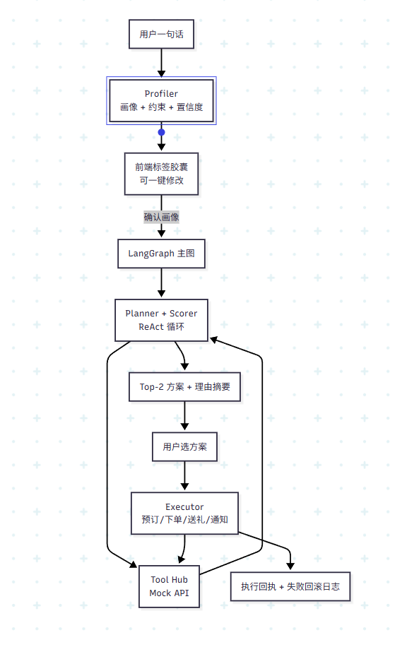

# 02 · 架构与 Agent 设计（共识版）

> 与 `01-题目工程拆解.md` 配套：接口契约以 01 为准（已锁）。本文档描述**如何实现**01中的**必做**，以及多 Agent 思路如何落地为可演示、可联调的工程形态。

---

## 1. 设计原则

1. **先闭环必做（P0）**：画像 → 规划（含检索与打分）→ 用户确认 → 模拟执行（订位/通知等）→ 可观测日志。
2. **延迟可控**：避免「4 次独立 LLM 串行」导致首字过慢；把「搜」与「排」放在可循环的 Planner 内，用 **少量 LLM 调用 + 多工具并发** 完成主路径。
3. **信息可回流**：规划中发现缺数据，应能继续调用检索类工具，而不是单向流水线卡死。
4. **Demo 友好**：主路径不依赖「多轮追问」；用**高置信推断 + 可编辑标签**承载不确定性。
5. **可解释**：方案排序必须有**可复述的规则**（权重与过滤条件），LLM 负责总结与包装，不负责黑盒拍脑袋排序。

---

## 2. 总体架构：「四个逻辑角色，一个状态机」

### 2.1 角色划分（对外讲故事 / 对内实现）

| 逻辑角色 | 职责 | 实现建议 |
|---|---|---|
| **Profiler（原 Agent1）** | 从一句话抽取结构化画像与约束；输出置信度与可编辑标签 | 单次 LLM + 严格 JSON Schema（或 Function Calling） |
| **Researcher（原 Agent2 的能力）** | 按 Planner 需要调用 Mock API：搜 POI、查桌位/排队、天气/路线等 | **工具层**，不单独占一轮「会聊天的 Agent」 |
| **Planner + Scorer（原 Agent3）** | 生成候选组合、硬约束过滤、加权打分、产出 Top-K 方案与摘要 | **ReAct / LangGraph 循环节点**：思考 → 调工具 → 反思 → 再调工具 |
| **Executor（原 Agent4）** | 用户确认后：预订、下单、送礼、分享通知；失败补偿与回滚 | 独立节点；输入为「已选方案 + 幂等键」 |

### 2.2 为什么把 Agent2 与 Agent3 合并到 Planner

- 规划过程中常出现「还需要再查排队 / 再换一批候选」的需求；若严格串行，**无法回流**。
- 「搜」本质是工具调用；单独做一个「会聊天的搜索 Agent」容易增加一次 LLM 往返，**性价比低**。
- 合并后：对外仍可讲「检索与规划分工」，对内是 **Planner 编排工具**，工程更简单。

### 2.3 架构图（Mermaid）



---

## 3. Profiler（Agent1）设计

### 3.1 主路径策略：推断优先，追问降级

- **默认**：一次推断产出完整 `UserProfile` + `implicit_constraints` + `confidence`。
- **追问**：仅作为「低置信字段」的补救；黑客松 Demo 主路径建议**不阻塞**在追问上。
- **交互替代追问**：前端展示「标签胶囊」，低置信标签视觉弱化；用户可点改，改完再走 Planner。

### 3.2 输出 Schema（建议字段）

```json
{
  "raw_query": "string",
  "profile": {
    "mode": "family | friends | mixed",
    "party_size": 3,
    "roles": [
      { "role": "self", "age_group": "adult" },
      { "role": "spouse", "tags": ["dieting"] },
      { "role": "child", "age": 5, "tags": ["toddler"] }
    ],
    "time_window": { "start": "14:00", "end": "18:00", "duration_hours": 4 },
    "geo": { "anchor": "user_gps_or_city", "radius_km": 5 },
    "budget_per_person": { "min": 100, "max": 300 },
    "hard_filters": ["needs_kid_friendly", "needs_low_calorie_options"],
    "soft_preferences": ["park", "exhibition", "citywalk"]
  },
  "confidence": {
    "party_size": 1.0,
    "time_window": 0.9,
    "budget_per_person": 0.4,
    "radius_km": 0.6
  },
  "ui_chips": [
    { "key": "party_size", "label": "3 人", "confidence": "high" },
    { "key": "budget", "label": "约 200 元/人（推测）", "confidence": "low" }
  ]
}
```

### 3.3 隐含约束规则（工程落地方式）

- **规则表 + LLM 补全**：先用确定性规则覆盖赛题给定场景（儿童年龄、减肥、朋友 4 人等），LLM 负责把自然语言映射到规则标签。
- **历史数据**：P0 可不接真实历史；在 `profile` 预留 `history_hints: []` 字段，后续接 Mock 即可讲故事。

---

## 4. Planner + Scorer（合并原 Agent2/3）

### 4.1 Planner 的工作流（建议固定为可复述步骤）

1. **分解时间轴骨架**：`玩 → 吃 →（可选）增项`，每段给出目标时长区间（与赛题 4–6 小时一致）。
2. **并行检索候选**：对每个阶段并发调用 `search_poi`（Top-N，例如 N=5）。
3. **硬约束过滤**（确定性代码，不交给 LLM）：
   - 营业时间与时间窗冲突 → 剔除
   - 人数与桌位/排队不可接受 → 剔除或降权
   - 地理距离/路程时间导致总时长溢出 → 剔除
   - 画像硬过滤（儿童友好、低卡选项等）→ 剔除
4. **组合与打分**：在剩余候选上做组合（可先限制组合规模，避免爆炸）。
5. **Top-K + LLM 包装**：对 Top-2 生成「为什么选它」的一句话摘要（LLM 调用次数可控）。

### 4.2 打分函数（可解释、可直接写进设计文档）

对单个完整方案 `combo`（含多 POI 与时间段）定义：

- `s_preference`：标签与 `implicit_constraints` / `hard_filters` 的匹配度（0–1）
- `s_geo`：实际路径总距离相对可接受上限的归一化（越近越高）
- `s_time`：排队/等待对时间窗的占用（越省时间越高）
- `s_budget`：总花费相对预算的偏离（越接近预算曲线越高，可容忍小幅超出）
- `s_rating`：POI 评分均值 / 5
- `s_diversity`：类目多样性（避免三段全是「逛街」）

示例加权（权重可在文档中声明为「初版」，Demo 前微调）：

```
score = 0.30*s_preference
      + 0.20*s_geo
      + 0.20*s_time
      + 0.15*s_rating
      + 0.10*s_budget
      + 0.05*s_diversity
```

**原则**：排序主责任在代码；LLM 只做「解释与叙事」，避免黑盒排序被评委追问时答不上来。

### 4.3 Planner 的循环边界（防止无限 ReAct）

- 最大工具轮次：例如 `max_tool_rounds = 6`（按队情调整）
- 最大候选规模：每阶段 `N ≤ 5`，组合爆炸时启用「分阶段贪心」或「两阶段规划」
- 超时：单轮规划总时长上限（与 01 中 NFR 对齐）

---

## 5. Executor（Agent4）设计

### 5.1 触发条件

- 仅在用户**显式确认**方案后进入（避免误下单叙事）。
- 所有写操作携带 `idempotency_key`（与 01 中 Mock 契约一致）。

### 5.2 执行编排

- **可并行**：无依赖的写操作并行（例如「订位」与「分享通知」若业务允许）。
- **必须有回执**：每个工具返回 `order_id/status` 进入状态机，供 UI 展示「一键落地」。
- **失败策略**：参考 01 的异常表；Executor 负责触发 `cancel` / 替换 / 重试的补偿路径，并写入 `rollback_log`。

---

## 6. 共享状态（LangGraph State 建议）

> 目标：全链路只有一个「真源状态」，节点间不通过「长字符串」传话。

建议字段（可与实现语言对齐为 TypedDict / Pydantic）：

- `raw_query`, `profile`, `confidence`, `profile_overrides`（用户改标签后的覆盖）
- `tool_trace[]`（工具名、入参、出参摘要、耗时）
- `candidates{}`（分阶段候选列表）
- `scored_plans[]`（plan + score + breakdown）
- `selected_plan_id`
- `executions[]`, `rollback_log[]`
- `errors[]`

---

## 补充

| 01 章节 | 本文档落点 |
|---|---|
| FRD P0（必做） | Profiler + Planner/Tool + Executor 全链路 |
| Mock API / 故障注入 | Tool Hub；Planner/Executor 的异常与重试演示 |
| 用户故事 / Demo 脚本 | Profiler 标签编辑 + Top-2 + 自愈执行 |


1. **State Schema 冻结**（字段名与 01 的 Tool 入参对齐）
2. **Profiler JSON 稳定**（Pydantic 校验失败则 reprompt 一次，仍失败则降级为规则兜底）
3. **Planner：先硬过滤 + 打分跑通**（哪怕 LLM 只写摘要）
4. **Executor：单写操作成功路径** → 再补失败注入与回滚 Demo

---

