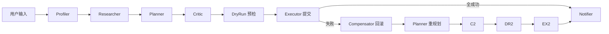

# 04. 第一阶段展示

> 本文档基于**真实跑通记录**整理。  
> 命令：`cd apps/api` → `python -m weekend_agent.demo --scene family`（主路径）  
> 补偿链：`python -m weekend_agent.demo --scene family --fail 吃`

---

## 一、你怎么跑（PyCharm 一句话）

底部 Terminal 已显示 `(.venv)` 且目录在 `apps\api` 时，直接执行上面两条命令即可。  
首行 `Mock 美团：ASGI 内联（默认）` 表示 Tool 走 HTTP 协议、进程内 Mock，无需另开端口。

---

## 二、展示用输入

```text
今天下午是空的，想和老婆孩子出去玩几个小时，别离家太远，老婆最近在减肥，孩子 5 岁，帮我安排一下。
```

补偿链额外开关：`--fail 吃`（仅第一次下单时让「吃」阶段返回满座 409）。

---

## 三、全链路（对照终端每一行 trace）



---

## 四、主路径实测：`demo --scene family`

### 4.1 完整终端输出（你的跑通记录）

```text
Mock 美团：ASGI 内联（默认）　可设 MOCK_MEITUAN_BASE_URL 切换

╭─ 用户输入 ─╮
│ 今天下午是空的，想和老婆孩子出去玩几个小时，别离家太远，老婆最近在减肥，孩子 5 岁，帮我安排一下。 │
╰─────────────╯

── 执行链路 ──
  [Profiler] scene=family(conf=0.92) people=3 start=14:00 dietary=['低卡'] interests=['亲子']
             tags=['家庭', '3 人', '≤ 8 km', '约 5 小时', '孩子 5岁', '14:00 出发']
  [Researcher] 阶段 3，候选 6 项｜默认选中：玩=奥林匹克森林公园，吃=Wagas 沙拉轻食（奥森店），加餐=原麦山丘 小蛋糕（送至餐厅）
  [Planner] 首次规划：家庭周末（玩 → 吃 → 加餐）：奥林匹克森林公园 → Wagas 沙拉轻食（奥森店） → 原麦山丘 小蛋糕（送至餐厅）
            （来源=research，3 阶段，预计 ¥275，score=0.68；备选 吃 → 加餐 → 玩 score=0.68）
  [Planner·校验] approved=True issues=0 ✓
  [Executor·预检] 打听 3 项：3 可执行 ✓
  [Executor·提交] 成功 3 笔 ✓
  [Executor·交付] 行程卡已生成 ✓，分享文案: 搞定了，下午 14:00 出发，先去 奥林匹克森林公园，之后...

── 最终行程卡 ──
  14:00–16:30  玩    奥林匹克森林公园             M52ECD2C220
  17:00–19:00  吃    Wagas 沙拉轻食（奥森店）     MAB673E3DE9
  18:30–18:45  加餐  原麦山丘 小蛋糕（送至餐厅）  M2EE1C48E62

  备选方案：方案 1（吃 → 加餐 → 玩，score=0.68，约 ¥275）：Wagas → 蛋糕 → 奥森

── State 摘要 ──
  scene=family, evidence_count=8, plan_iteration=1, plan_alternatives=1, executed=3, failed=0
```

> 订单号 `M52ECD2C220` 等每次运行随机，**有订单号即表示 HTTP 下单成功**，不是写死的假字符串。

### 4.2 执行链路 × 亮点对照表

| 终端 trace 行 | 对应节点 | 输入 → 输出（摘要） | **亮点** |
|---------------|----------|---------------------|------------------------|
| `[Profiler] scene=family … dietary=['低卡'] interests=['亲子']` | `profiler` | **入**：用户一句话<br>**出**：`group_profile` | **画像 + 证据链**：从「老婆孩子」→ 家庭 scene=0.92；「减肥」→ 低卡；「5 岁」→ kids；「别太远」→ distance≤8km。`evidence_count=8` 表示 8 条可解释依据（见 `03.细节实现.md`）。 |
| `tags=['家庭','3 人','≤ 8 km',…]` | 同上 | `editable_tags` | **前端胶囊**：标签可直接给 UI 展示/点改（回写未做）。 |
| `[Researcher] 阶段 3，候选 6 项｜玩=奥森…吃=Wagas…` | `researcher` | **入**：`group_profile`<br>**出**：`research_result`（3 阶段 × Top3） | **Mock HTTP 检索 + 五维打分**：每阶段 `GET /poi/search`；玩/吃/加餐共 6 个候选进榜，各阶段选 breakdown 最高的一家（如奥森、Wagas）。 |
| `[Planner] 首次规划 … score=0.68；备选 吃→加餐→玩` | `planner` | **入**：research + profile<br>**出**：`plan` + `plan_alternatives` | **硬过滤 + 双顺序 + Top2**：试过「玩→吃」与「吃→玩」两种时间轴，主方案 score=0.68；另有一条备选顺序写在 trace 和行程卡底部。 |
| `来源=research，预计 ¥275` | 同上 | `Plan.total_cost_estimate` | **可算钱**：按人数 × 人均价汇总，不是空口报价。 |
| `[Planner·校验] approved=True` | `critic` | **入**：plan + profile<br>**出**：`critic_feedback.approved=true` | **规则校验**：低卡场景下餐厅须轻食；亲子场景下「玩」须亲子友好；不通过会打回 Planner 重规划。 |
| `[Executor·预检] 打听 3 项：3 可执行` | `dry_run` | **入**：plan<br>**出**：`dry_run_calls`（3 条读接口） | **先问再买**：查票/查桌/查库存，对应美团「打听」而非直接下单。 |
| `[Executor·提交] 成功 3 笔` | `executor` | **入**：预检通过的项<br>**出**：`executed_calls`（含 order_id） | **真 Tool 调用链**：经 HTTP `POST /order/*` 写入 Mock 订单簿；行程表里的 `M52ECD…` 即回执。 |
| 行程表三行 + **备选方案** | `notifier` | **入**：plan + executed<br>**出**：`summary_card` | **产品化交付**：Markdown 行程卡 + 微信 `share_text`；不只给一个 plan，还展示第二条路线备选。 |
| `plan_alternatives=1, executed=3, failed=0` | 终态 | `AgentState` 摘要 | **状态可观测**：答辩可对照 LangGraph State 字段讲闭环。 |

---

## 五、加分路径实测：`demo --scene family --fail 吃`

### 5.1 完整终端输出（你的跑通记录）

```text
⚠ 已注入失败开关：'吃' 阶段会下单失败

── 执行链路（比主路径多 4 行）──
  …（Profiler / Researcher / 首次 Planner 与主路径相同，仍选 Wagas）…
  [Executor·预检] 打听 3 项：3 可执行 ✓
  [Executor·提交] 成功 2 笔，失败 1 笔 ✗
  [Executor·回滚] 回滚 2 笔成功订单 ↩，失败原因: 订位失败：餐厅已满座
  [Planner·重规划#2] … 奥林匹克森林公园 → 新元素轻食 → 原麦山丘 小蛋糕
            （来源=research，预计 ¥365，score=0.62；备选 … score=0.62）
  [Planner·校验] approved=True issues=0 ✓
  [Executor·预检] 打听 3 项：3 可执行 ✓
  [Executor·提交] 成功 3 笔 ✓
  [Executor·交付] 行程卡已生成 ✓

── 最终行程卡（注意餐厅变了）──
  14:00–16:30  玩    奥林匹克森林公园             M2733627E6C
  17:00–19:00  吃    新元素轻食                   M287FBE8955
  18:30–18:45  加餐  原麦山丘 小蛋糕（送至餐厅）  M3CC2EA4586

── State 摘要 ──
  plan_iteration=3, executed=3, failed=0
```

### 5.2 与主路径对比

| 对比项 | 主路径（无 `--fail`） | 补偿链（`--fail 吃`） |
|--------|----------------------|------------------------|
| 餐厅 | Wagas 沙拉轻食 | **新元素轻食**（同阶段下一候选） |
| 预计花费 | ¥275 | ¥365（换店后人均变高） |
| 综合 score | 0.68 | 0.62（换店略降，仍可行） |
| trace 行数 | 7 行 | **11 行**（多回滚 + 重规划 + 第二轮预检/提交） |
| `plan_iteration` | 1 | **3**（含失败轮与成功轮） |
| 亮点故事 | 正常闭环 | **故障注入 → 回滚 → 避开失败 POI → 再成功** |

### 5.3 补偿链逐步亮点

| 步骤 | trace 关键词 | 亮点 |
|------|--------------|------|
| 1 | `成功 2 笔，失败 1 笔` | 部分成功是真实分布式场景：玩、加餐可能已成功，仅「吃」满座。 |
| 2 | `订位失败：餐厅已满座` | Mock HTTP 返回 **409**，与真美团错误语义一致，不是 Python 里 `return False`。 |
| 3 | `回滚 2 笔成功订单` | **Compensator** 对已成功订单调 `cancel_order`，避免「半套订单挂着」。 |
| 4 | `重规划#2` + `新元素轻食` | Planner 把 `poi_rest_021`（Wagas）加入 **blocked**，改选 research 候选里下一名的轻食店。 |
| 5 | 第二轮 `成功 3 笔` | 重走 预检→提交，最终 `failed=0`，用户仍拿到完整行程卡。 |

---

## 六、第一阶段「六大亮点」总表（对着终端讲）

| # | 亮点 | 你在终端里看到什么 | 代码落点 |
|---|------|-------------------|----------|
| 1 | 可解释画像 | `scene=family`、`dietary=低卡`、`evidence_count=8` | `agents/profiler.py` |
| 2 | 五维 POI 打分 | Researcher 固定选中奥森/Wagas/蛋糕，非随机 | `agents/researcher.py` + `breakdown` |
| 3 | 规划智能感 | 两种顺序 + `score=0.68` + 备选方案段落 | `agents/planner.py` |
| 4 | Mock HTTP Tool | 预检/下单有 `order_id`；首行 ASGI 内联 | `mock_meituan/` + `tools/http_client.py` |
| 5 | 校验闸门 | `approved=True issues=0` | `nodes/critic.py` |
| 6 | 补偿自愈 | `--fail 吃` 时 Wagas→新元素、回滚 2 笔 | `nodes/compensator.py` + Planner `blocked` |

更细的设计来源见 **`03.细节实现.md`**。

---

## 七、3 分钟答辩话术（

1. **开场**：「用户一句话，我们走 LangGraph 八个节点，输出的 trace 就是状态机每一步。」
2. **Profiler**：指 `family / 低卡 / 亲子 / 3人 / ≤8km`，说「有证据链，能答依据哪句话」。
3. **Researcher**：指三家店名，说「HTTP 搜 POI + 五维加权，不是写死排序」。
4. **Planner**：指 `score=0.68` 和「备选 吃→加餐→玩」，说「试了两种顺序并给 Top2」。
5. **Executor**：指「预检 3 项」和表格里三个 `M` 开头订单号，说「先打听再下单」。
6. **（加分）** 跑第二条命令：指「失败 1 笔 → 回滚 2 笔 → 重规划换 新元素轻食 → 再成功 3 笔」。
7. **收尾**：念 `share_text` 微信文案。

---

## 八、自查（你已完成可打勾）

- [x] `python -m weekend_agent.demo --scene family` 跑通  
- [x] `python -m weekend_agent.demo --scene family --fail 吃` 跑通  
- [ ] （可选）`python scripts/trace_run.py` 看每节点 JSON  
- [ ] （可选）`demo --history` 看历史偏好并入 interests  

---

## 九、相关文档

| 文档 | 用途 |
|------|------|
| `02.架构和agent.md` | 节点职责、State、路由 |
| `03.细节实现.md` | 亮点与设计来源对照 |
| `docs/mock-api.md` | Mock HTTP curl 演示 |
